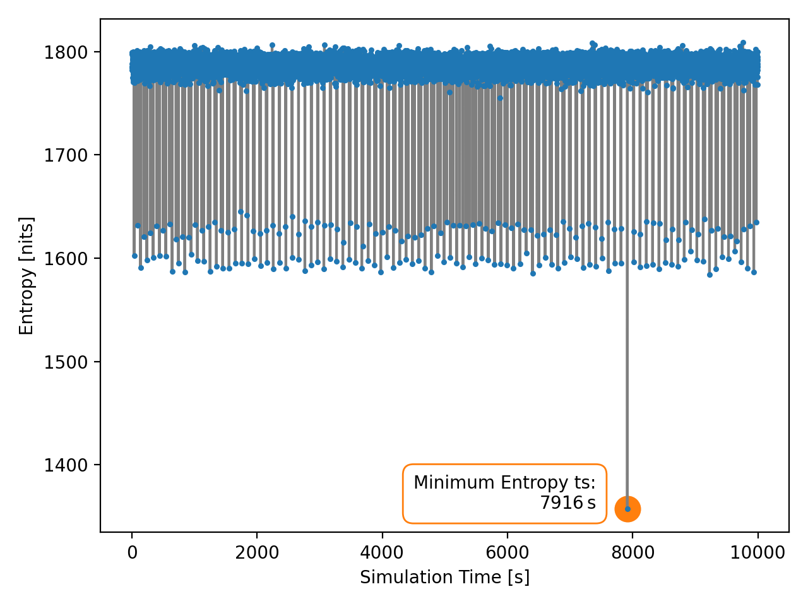
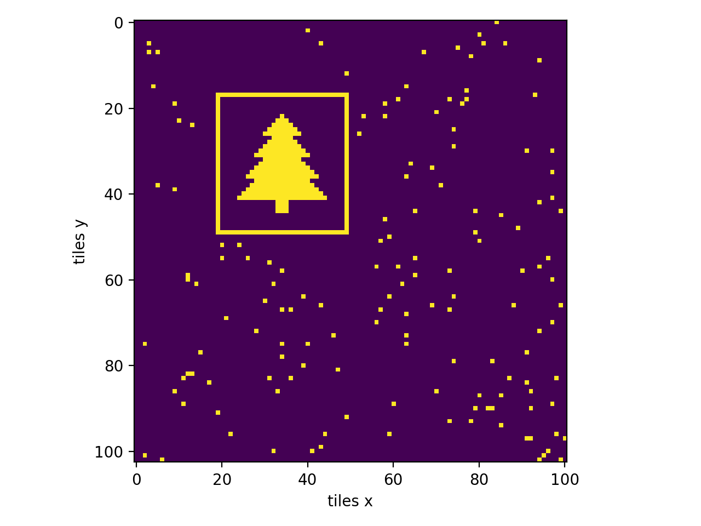

# Day 14

For part B use an entropy based method to search for highly ordered structure in the simulation.
Even in very general cases for all kinds of versions of christmas trees, this method should find the actual image.
The frame will turn up as a clear minimum of the entropy.

  
  

Final result Part B

